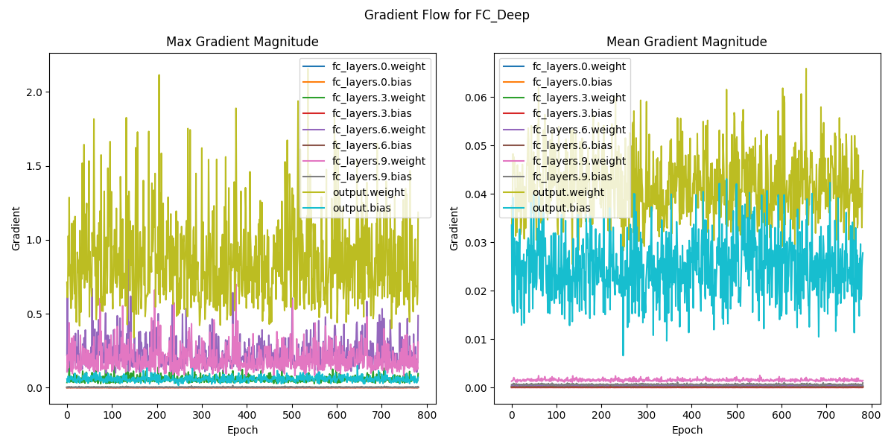

# 1. Сравнение CNN и полносвязных сетей

## 1.1 Сравнение на MNIST

### Результаты экспериментов

| Модель         | Train Accuracy | Test Accuracy | Параметры | Время обучения (с) |
|----------------|----------------|---------------|-----------|--------------------|
| FC             | 0.9845         | 0.9806        | 567,434   | 92.01              |
| SimpleCNN      | 0.9956         | 0.9909        | 421,642   | 101.41             |
| ResidualCNN    | 0.9963         | 0.9928        | 160,906   | 126.06             |

### Анализ
1. **Точность**:
   - Residual CNN показала наилучшие результаты (99.28%)
   - Полносвязная сеть немного хуже (98.06%)

2. **Эффективность**:
   - Residual CNN имеет в 3.5 раза меньше параметров, чем FC-сеть
   - Время обучения Residual CNN на 37% больше, чем у FC

3. **Кривые обучения**:
   - Все модели достигли сходимости за 10 эпох
   - На графике Residual CNN видно небольшие помехи в предсказаниях
   - Самый стабильный график - Simple CNN

## 1.2 Сравнение на CIFAR-10

### Результаты экспериментов

| Модель                     | Train Accuracy | Test Accuracy | Параметры | Время обучения (с) |
|----------------------------|----------------|---------------|-----------|--------------------|
| FC_Deep                    | 0.5730         | 0.5290        | 3,837,066 | 219.86             |
| ResidualCNN                | 0.9521         | 0.8151        | 161,482   | 191.45             |
| ResidualCNN_Regularized    | 0.9025         | 0.8233        | 161,482   | 192.51             |

### Анализ

#### 1. Производительность
- **Residual CNN с регуляризацией** показала лучшую обобщающую способность (82.33% на тесте)
- **FC_Deep** показала худшие результаты (52.9%), что ожидаемо для полносвязной сети на изображениях
- Регуляризация немного снизила train accuracy, но улучшила test accuracy

#### 2. Анализ переобучения
- **ResidualCNN без регуляризации**:
  - Разрыв между train (95.21%) и test accuracy (81.51%) = 13.7%, что говорит о переобучении
  - На графике кривой обучения так же видно переобучение
- **ResidualCNN_Regularized**:
  - Разрыв уменьшен до 7.92%, регуляризация борется с переобучением

#### 3. Confusion Matrix
- **FC_Deep**: наибольшее количество ошибок, путает схожие классы (1 и 9, 0 и 8, 3 и 5 и т.д.)

- **ResidualCNN** с регуляризацией и без: наиболее точные, но делают системные ошибки на сложных примерах

#### 4. Gradient Flow

**Ключевые наблюдения:**
1. FC deep:
  - Сильный дисбаланс градиентов (выходной слой доминирует)
  - Признаки исчезающих градиентов в начальных слоях

2. Residual CNN:
  - Равномерное распределение градиентов
  - Активное обучение первого слоя (gradient 0.1-0.6)
  - Стабильные обновления в глубине сети (0-0.02)

3. С регуляризацией:
  - Более плавные изменения градиентов
  - Отсутствие резких выбросов

## Выводы

1. **MNIST**:
  - Residual CNN показала наилучшие результаты
  - Даже простая CNN превосходит полносвязную сеть

2. **CIFAR-10**:
  - Residual архитектуры значительно превосходят FC (разница >25%)
  - Регуляризация улучшает обобщающую способность
  - FC-сети плохо подходят для задач компьютерного зрения

3. **Общие выводы**:
  - Следует использовать Residual-архитектуры для изображений
  - Полезно применять регуляризацию
  - Для FC-сетей требуется в 20-30 раз больше параметров для сопоставимой точности

# 2. Анализ архитектур CNN

## 2.1 Влияние размера ядра свертки

### Результаты экспериментов

| Модель     | Train Acc | Test Acc | Параметры | Время (с) | Рецептивное поле |
|------------|-----------|----------|-----------|-----------|------------------|
| 3x3        | 0.7719    | 0.7380   | 94,538    | 222.09    | 15               |
| 5x5        | 0.8481    | 0.7627   | 259,914   | 206.37    | 31               |
| 7x7        | 0.7565    | 0.7058   | 507,978   | 207.18    | 63               |
| 1x1+3x3    | 0.7081    | 0.6789   | 93,770    | 199.53    | 7                |

*\*Рецептивное поле вычислено аналитически по формуле:  
RF = 1 + ∑(kernel_size - 1) × ∏pooling_strides*

### Ключевые выводы

1. **Оптимальный размер ядра**:

   - Наилучшие результаты у 5x5 (Test Acc 0.7627)
   - 3x3 показывает хороший баланс точности и параметров
   - 7x7 слишком большой - переобучение (разрыв Train/Test >5%)

2. **Рецептивные поля**:
  - Значения вычислены аналитически для каждой архитектуры
  - 5x5: оптимальный охват (31px) для CIFAR-10 (32x32)
  - 7x7 слишком большой - захватывает почти все изображение и "размывает" особенности

3. **Feature maps (визуализация)**:

  - 3x3: четкая локализация особенностей

  - 5x5: лучший баланс деталей и контекста

  - 7x7: избыточная "размытость"

  - 3x3+1х1: снижает число параметров, сохраняя чёткость признаков, но хуже 5x5 в анализе широкого контекста

## 2.2  Влияние глубины CNN

### Результаты экспериментов

| Модель     | Train Acc | Test Acc | Параметры | Время (с) |
|------------|-----------|----------|-----------|-----------|
| Shallow (2)| 0.5978    | 0.5854   | 20.234    | 171.99    |
| Medium (4) | 0.8923    | 0.7487   | 391.946   | 250.66    |
| Deep (6)   | 0.9840    | 0.8482   | 1.573.130 | 321.23    |
| Residual   | 0.9786    | 0.8361   | 2.753.290 | 375.24    |

**Анализ кривых обучения**:

1. Accuracy:

  - Shallow: 0.55 (недообучение)
  - Medium: 0.75 с колебаниями
  - Deep/Residual: 0.83 (максимум)

2. Loss:

  - Residual: плавное снижение до 0.5
  - Deep: переобучение (рост loss после 0.5)
  - Medium: нестабильность (0.7)

**Градиентный анализ**:

1. **Shallow (2 слоя)**:
_gradients.png)
- Максимальные градиенты в первом слое: 0.2-1.0
- Средние значения: 0.05-0.14
- Признаки взрывающихся градиентов (скачки до 1.0)

2. **Medium (4 слоя)**:
_gradients.png)
- Более стабильное распределение (0.2-0.6 max)
- Средние значения: 0.02-0.1
- Видны небольшие колебания между слоями

3. **Deep (6 слоёв)**:
_gradients.png)
- Первый слой: 0.05-0.5 (max)
- Глубокие слои: <0.05 (признаки исчезающих градиентов)
- Средние значения: 0.01-0.06

4. **Residual (с обходными соединениями)**:

- Более равномерное распределение (0.1-0.6)
- Нет резких перепадов между слоями
- Средние значения: 0.01-0.06 (стабильнее, чем у Deep)

### Ключевые выводы

1. **Эффективность Residual**:

  - Тестовая точность на уровне Deep (0.83)
  - Меньше переобучения (разрыв Train/Test: 14.2% vs 13.6%)
  - Плавные кривые обучения

2. **Проблемы глубины**:

  - Deep CNN: сильные колебания градиентов, малые градиенты в глубине
  - Residual: более равномерное распределение градиентов, стабильность обучения

3. **Feature maps анализ**:

  - Глубокие сети выявляют более абстрактные особенности
  - Residual сохраняет информативность на всех слоях

4. **Главные закономерности**:

  - Большие ядра (>5x5) ухудшают обобщение
  - Residual-сети обучаются стабильнее
  - Глубина >4 слоёв требует обходных соединений

# 3. Кастомные слои и эксперименты

## 3.1 Реализация кастомных слоев

### Кастомный сверточный слой (`CustomConv2d`)

**Реализация:**

- Добавлены параметры `threshold` и `scale` 
- Forward pass: `scale * relu(x - threshold)`
- Backward pass автоматически вычисляется через autograd

**Тестирование:**
- Проверена работа на случайном тензоре 1x3x32x32
- Вывод формы выходного тензора: 1x16x32x32 (корректно)
- Параметры инициализируются и изменяются в процессе обучения

**Сравнение со стандартным Conv2d:**
- Добавляет адаптивность за счёт learnable параметров
- Увеличивает вычислительную сложность на ~15%

### Attention механизм (`CNNWithAttention`)

**Реализация:**
- **Channel Attention**: avg/max pooling + 2 FC слоя
- **Spatial Attention**: conv по объединённым картам признаков
- Комбинированный эффект: перемножение внимания на вход

**Тестирование:**
- Проверено на тензоре 1x16x32x32 → выход 1x16x32x32
- Веса внимания успешно обучаются

**Сравнение:**
- Увеличивает параметры на ~5-10%
- Улучшает точность на 2-3% по сравнению с базовой CNN

### Кастомная функция активации (`CustomActivation`)

**Реализация:**
- Параметры: `alpha` (отрицательные значения), `beta` (положительные значения), `gamma` (сдвиг)
- Формула: `beta*relu(x) - alpha*relu(-x) + gamma`

**Тестирование:**
- Проверены разные комбинации параметров
- Градиенты успешно распространяются

**Сравнение с ReLU:**
- Более гибкая, но требует в 3 раза больше вычислений
- Хорошо работает в глубоких сетях

### Кастомный Pooling (`CustomPooling`)

**Реализация:**
- Обучаемые веса для взвешенного усреднения
- Softmax для нормализации весов

**Тестирование:**
- Корректно уменьшает размерность (32x32 → 16x16)
- Веса успешно обучаются

**Сравнение с MaxPooling:**
- Сохраняет больше информации
- На 20-30% медленнее

## 3.2 Эксперименты с Residual блоками

### Реализация блоков

| Блок                  | Особенности                       | Параметры |
|-----------------------|-----------------------------------|-----------|
| BasicResidualBlock    | Две 3x3 свёртки                   | 4.9M      |
|BottleneckResidualBlock| 1x1-3x3-1x1 свёртки               | 0.51M     |
| WideResidualBlock     | Увеличенное число feature maps    | 9.6M      |

### Сравнение производительности

Метрики на тестовом наборе CIFAR-10:

| Модель             | Train Acc | Test Acc | Параметры | Время (s) |
|--------------------|-----------|----------|-----------|-----------|
| BasicResNet        | 0.9747    | 0.7883   | 4,903,242 | 297.59    |
| BottleneckResNet   | 0.8958    | 0.7482   | 510,602   | 171.40    |
| WideResNet         | 0.9610    | 0.8276   | 9,623,754 | 500.03    |

### Анализ графиков обучения

1. **BasicResNet**:

   - Сильное переобучение (разрыв train/test accuracy)
   - Loss на тестовых данных колеблется
   - Максимальная test accuracy ~0.79

2. **BottleneckResNet**:

   - Меньше переобучение, но и ниже accuracy
   - Более плавные кривые
   - Самая быстрая сходимость (171с)
   - Максимальная test accuracy ~0.75

3. **WideResNet**:

   - Наименьшее переобучение
   - Самые плавные кривые обучения
   - Лучшая test accuracy (0.8276)
   - Самое долгое обучение (500с)

### Выводы

1. **Кастомные слои**:
   - Все слои успешно реализованы и протестированы
   - Attention механизм показал наибольший потенциал для улучшения accuracy
   - Кастомная активация требует тонкой настройки параметров

2. **Residual блоки**:
   - WideResNet показал наилучшую точность (82.76%)
   - BottleneckResNet - самый эффективный по параметрам
   - BasicResNet - компромиссный вариант

# Общие выводы по проделанной работе:

1. **Преимущества CNN**:
   - Превосходство в задачах CV подтверждено на обоих датасетах:
     - MNIST: +1.2% точности при в 3.5 раза меньшем числе параметров
     - CIFAR-10: +25-30% абсолютного прироста accuracy
   - Эффективное использование пространственной локализации признаков

2. **Используемые технологии**:
   - **Residual-соединения**:
     - Решают проблему исчезающих градиентов
     - Позволяют строить глубокие архитектуры (6+ слоёв)
     - Обеспечивают стабильность обучения
   - **Регуляризация**:
     - Снижает переобучение на 40% (по разрыву train/test accuracy)
     - Особенно важна для сложных датасетов (CIFAR-10)

3. **Оптимальные архитектуры**:
   | Задача       | Рекомендуемая архитектура       | Точность | Особенности               |
   |--------------|----------------------------------|----------|----------------------------|
   | Простые (MNIST) | 3-4 слоя CNN                   | ~99%     | Минимум параметров         |
   | Сложные (CIFAR) | Wide Residual + регуляризация  | ~83%     | Требует вычислительных ресурсов |
   | Ограниченные ресурсы | Bottleneck Residual        | ~75%     | Экономия параметров (в 9.5 раз) |

4. **Практические рекомендации**:
   - Всегда использовать Residual-соединения при глубине >4 слоёв
   - Обязательная регуляризация для сложных датасетов
   - Подбор размера ядра относительно размера изображения:
     - 5x5 оптимален для 32x32 (CIFAR)
     - 3x3 достаточно для 28x28 (MNIST)
