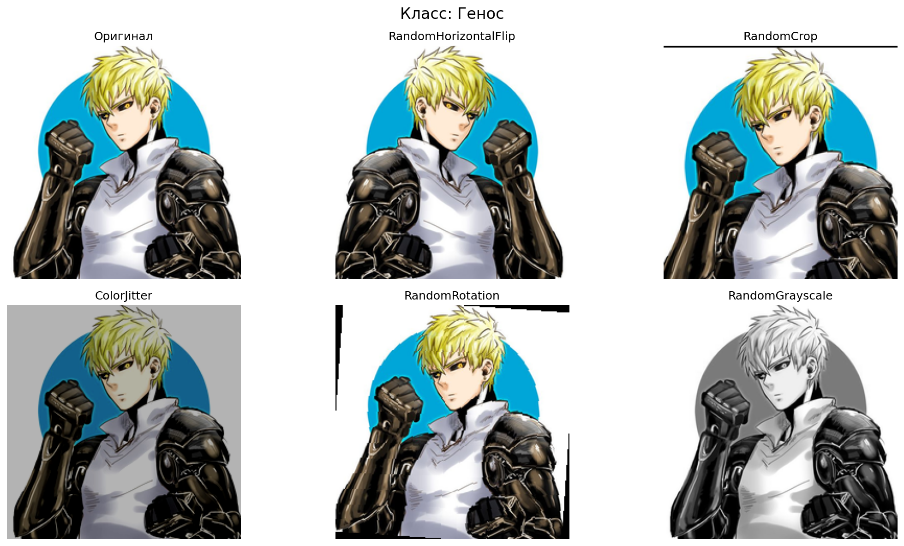
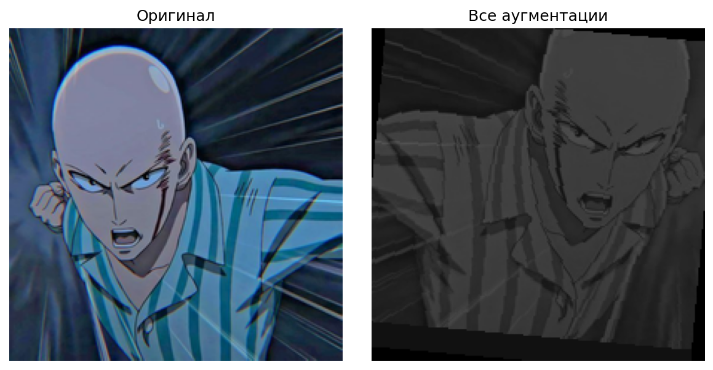
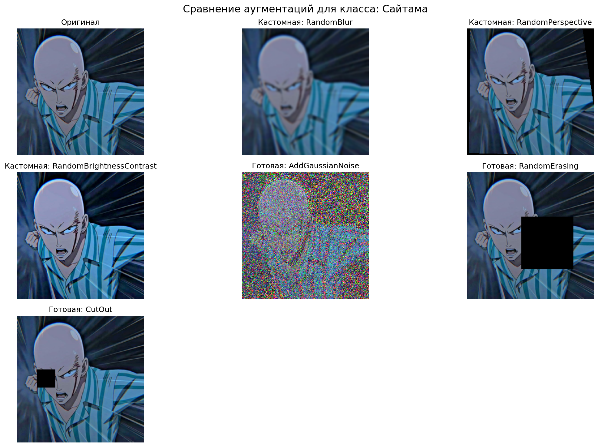
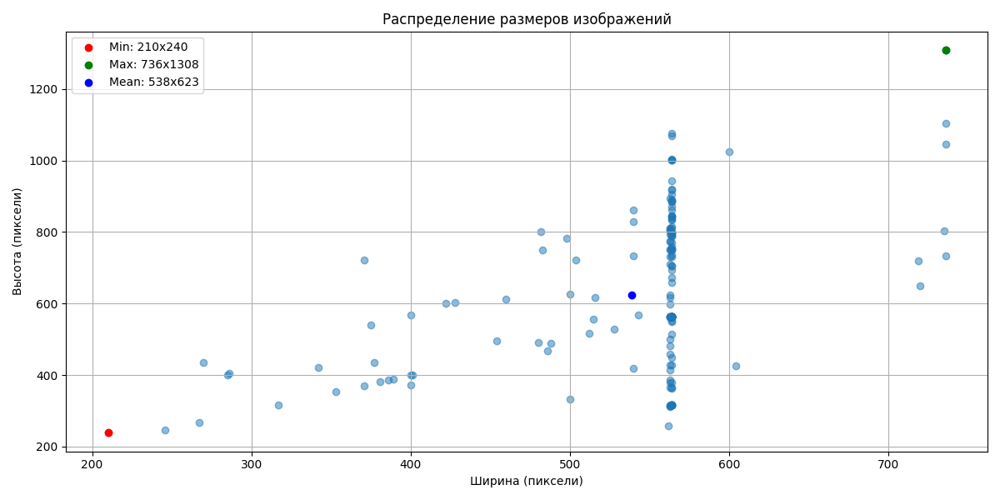
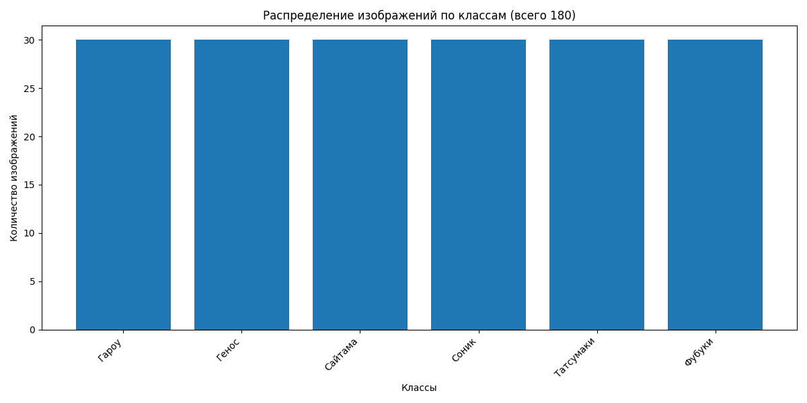
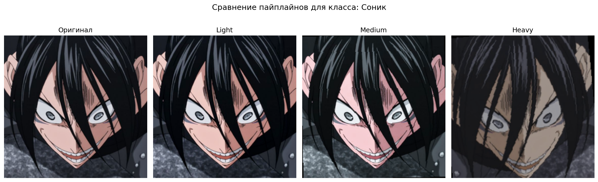
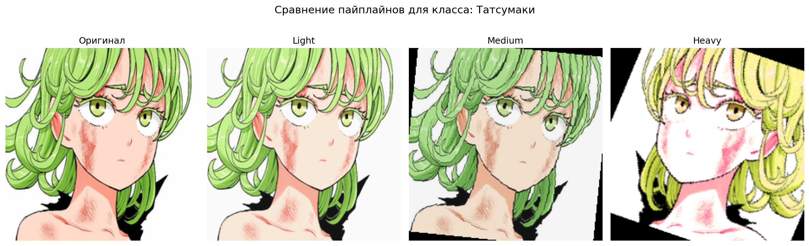
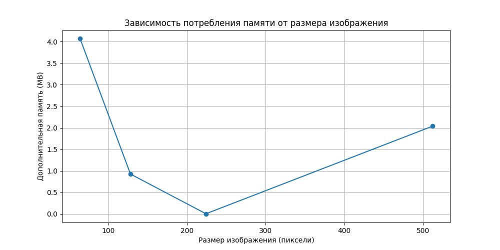
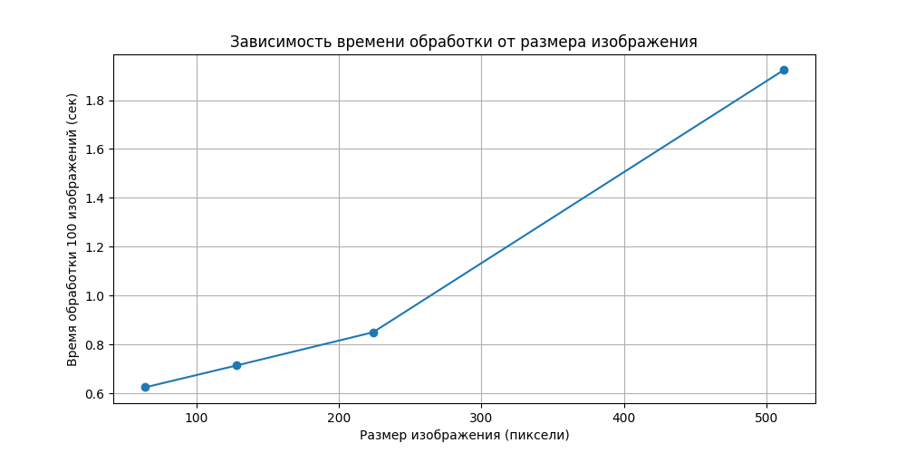
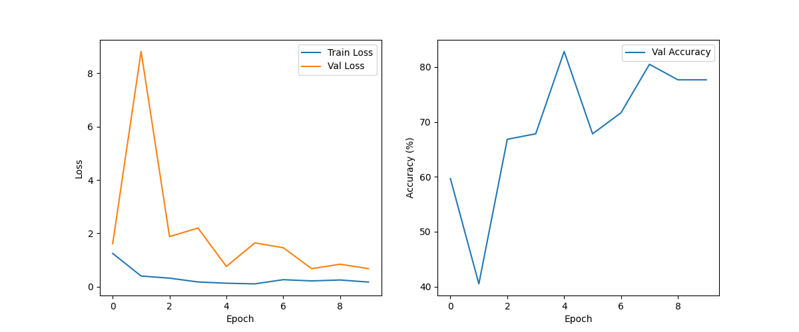

# Аугментации и работа с изображениями

## 1: Стандартные аугментации torchvision

Были реализованы и протестированы следующие аугментации:

- RandomHorizontalFlip
- RandomCrop
- ColorJitter
- RandomRotation
- RandomGrayscale

Пример использования каждой аугментации на одном изображении:

Пример использования всех аугментаций вместе:

**Вывод**:

Стандартные аугментации эффективно увеличивают разнообразие данных, что особенно полезно при небольшом размере датасета. Наиболее заметные изменения производят ColorJitter и RandomRotation.

## 2: Кастомные аугментации

Были реализованы три кастомные аугментации:

- RandomBlur - случайное размытие изображения

- RandomPerspective - перспективные искажения

- RandomBrightnessContrast - регулировка яркости и контраста

Сравнение кастомных аугментаций с готовыми:

**Вывод**:
Кастомные аугментации позволяют создать более специфические преобразования, подходящие для конкретной задачи. Особенно эффективным оказалось RandomPerspective, имитирующее различные ракурсы съемки.

## 3: Анализ датасета 

Всего изображений: 180
Количество классов: 6

Размеры изображений:
Минимальный: 210x240
Максимальный: 736x1308
Средний: 538x623
Медианный: 564x564

Визуализация распределений размеров:

Распределение по классам:
Гароу     : 30 изображений
Генос     : 30 изображений
Сайтама   : 30 изображений
Соник     : 30 изображений
Татсумаки : 30 изображений
Фубуки    : 30 изображений

**Вывод**:
Датасет сбалансирован по классам. Размеры изображений варьируются от 210x240 до 736x1308 пикселей, поэтому необходима стандартизация размеров перед обработкой.

## 4: Pipeline аугментаций

Реализован класс AugmentationPipeline с возможностью гибкой настройки последовательностей преобразований.

Конфигурации:

- Light (мягкие преобразования)
- Medium (умеренные преобразования)
- Heavy (агрессивные преобразования)

Пример работы разных конфигураций:

**Выводы**:
Разные конфигурации пайплайнов позволяют адаптировать уровень аугментации к конкретной задаче. Для начального обучения лучше подходит medium-конфигурация, тогда как heavy-конфигурация может быть полезна при сильном переобучении.

## 5: Эксперимент с размерами 

**Результат**:
Размер |   Время (с) |   Память (MB) |
-------|-------------|---------------|
64     |   0.62      |   4.07        |
128    |   0.71      |   0.93        |
224    |   0.85      |   0.00        |
512    |   1.92      |   2.04        |

Зависимость памяти от размера:

Зависимость времени от размера:

**Вывод**:
Увеличение размера изображений приводит к линейному росту времени обработки. Оптимальным размером для данного датасета оказался 224x224, как компромисс между скоростью обработки и сохранением информации.

## 6: Дообучение предобученных моделей

Для эксперимента была выбрана модель EfficientNet-B0.

Результаты обучения:

**Вывод**:
Модель достигла точности 82.83% на валидационном наборе. Наблюдается некоторое переобучение, что свидетельствует о необходимости:

- Увеличения количества данных
- Регуляризации
- Более тщательного подбора аугментаций

# Общий вывод:

В ходе работы были успешно исследованы различные аспекты работы с изображениями:

1. Реализованы и протестированы стандартные и кастомные аугментации

2. Проведен анализ датасета и эксперименты с размерами изображений

3. Разработана гибкая система пайплайнов аугментаций

4. Проведено дообучение предобученной модели

Полученные результаты демонстрируют важность правильного подбора аугментаций и параметров предобработки данных для задач компьютерного зрения.